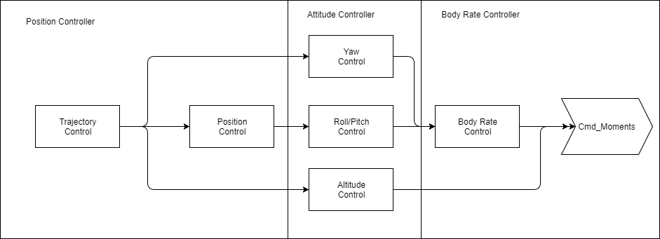

# FCND Controls Project

For this project, you will write the low level flight controllers for the vehicle. In the previous projects, commanded positions were passed to the simulation. In this project, commands will be passed as three directional body moments and thrust. Using the position, velocity, attitude, and body rates sent from the simulation, you will first write several nested control loops to achieve waypoint following control of the first project. Next, you'll expand these capabilities to follow a timed trajectory. The goal of the trajectory following will be to arrive at the end within the specified time while maintaining position errors below a threshold. After the Python portion of the project, you will modify a C++ controller.

For easy navigation, this document is broken up into the following sections:

 - [Environment Setup](#environment-setup)
 - [Update Backyard Flyer Solution](#update-backyard-flyer-solution)
 - [Get Familiar with the Code](#get-familiar-with-the-code)
 - [The Tasks](#the-tasks)
 - [Additional Resources](#additional-resources)


## Setup Your Environment ##

### Step 1: download the simulator

In this beta version the simulator is provided in the repository. For students, this step will read: If you haven't already, download the version of the simulator that's appropriate for your operating system [from this repository]() (TODO: link to be added).

### Step 2: set up your python environment

If you haven't already, set up your Python environment and get all the relevant packages installed using Anaconda following instructions in [this repository](https://github.com/udacity/FCND-Term1-Starter-Kit)

#### Make sure Udacidrone is to to date

Let's quickly make sure you have the most up to date version of udacidrone, which will allow you to use the full functionality of the controls simulator environment.

First make sure you have activated your environment:

```sh
source activate fcnd
```

Then run the update:

```sh
pip install udacidrone --upgrade
```


### Step 3: clone this repository

```sh
git clone https://github.com/udacity/FCND-Controls
```

### Step 4: test setup

Your starting point here will be the [solution code](https://github.com/udacity/FCND-Backyard-Flyer/blob/solution/backyard_flyer.py) for the Backyard Flyer project. Before you start modifying the code, make sure that your Backyard Flyer solution code works as expected and your drone can perform the square flight path in the new simulator. To do this, start the simulator and run the [`backyard_flyer.py`](https://github.com/udacity/FCND-Backyard-Flyer/blob/solution/backyard_flyer.py) script.

```py
source activate fcnd # if you haven't already sourced your Python environment, do so now.
python backyard_flyer.py
```

The quad should take off, fly a square pattern and land, just as in the previous project. If everything works then you are ready to move to the next step and modify `backyard_flyer.py` to get it ready to use your custom controller.

## Update Backyard Flyer Solution ##

The following modifications need to be made to the solution `backyard_flyer.py`. Feel free to use a copy of your own solution to the Backyard Flyer Project or the one in the link provided.

### Step 1

Import the `UnityDrone` and `NonlinearController` classes and modify the `BackyardFlyer` class to be a subclass of `UnityDrone` instead of `Drone`. `UnityDrone` is a subclass of `Drone`, so it provides all the functionality of `Drone` along with additional Unity specific commands/functionality (see below).

```py
from unity_drone import UnityDrone
from controller import NonlinearController
...
class BackyardFlyer(UnityDrone):
```

### Step 2

Add a controller object in the `__init__` method:

```py
def __init__(self, connection):
    ...
    self.controller = NonlinearController()
```

### Step 3

Add the following three methods to your class to incorporate the controller into the backyard flyer.

```py

def position_controller(self):
    """Sets the local acceleration target using the local position and local velocity"""
    
    (self.local_position_target, self.local_velocity_target, yaw_cmd) = self.controller.trajectory_control(self.position_trajectory, self.yaw_trajectory, self.time_trajectory, time.time())
    self.attitude_target = np.array((0.0, 0.0, yaw_cmd))

    acceleration_cmd = self.controller.lateral_position_control(self.local_position_target[0:2], self.local_velocity_target[0:2], self.local_position[0:2], self.local_velocity[0:2])
    self.local_acceleration_target = np.array([acceleration_cmd[0], acceleration_cmd[1], 0.0])
    
def attitude_controller(self):
    """Sets the body rate target using the acceleration target and attitude"""
    self.thrust_cmd = self.controller.altitude_control(-self.local_position_target[2], -self.local_velocity_target[2], -self.local_position[2], -self.local_velocity[2], self.attitude, 9.81)
    roll_pitch_rate_cmd = self.controller.roll_pitch_controller(self.local_acceleration_target[0:2], self.attitude, self.thrust_cmd)
    yawrate_cmd = self.controller.yaw_control(self.attitude_target[2], self.attitude[2])
    self.body_rate_target = np.array([roll_pitch_rate_cmd[0], roll_pitch_rate_cmd[1], yawrate_cmd])
    
def bodyrate_controller(self):  
    """Commands a moment to the vehicle using the body rate target and body rates"""
    moment_cmd = self.controller.body_rate_control(self.body_rate_target, self.gyro_raw)
    self.cmd_moment(moment_cmd[0], moment_cmd[1], moment_cmd[2], self.thrust_cmd)
```

### Step 4

Register and add callbacks for the `RAW_GYROSCOPE`, `ATTITUDE`, and `LOCAL_VELOCITY` messages. Call the appropriate level of control in each callback (i.e. `bodyrate_controller()` is called in `gyro_callback()`):

```py
def __init___(self,connection):
    ...
    self.register_callback(MsgID.ATTITUDE, self.attitude_callback)
    self.register_callback(MsgID.RAW_GYROSCOPE, self.gyro_callback)
    self.register_callback(MsgID.LOCAL_VELOCITY, self.velocity_callback)
    
def attitude_callback(self):
    ...
    if self.flight_state == States.WAYPOINT:
        self.attitude_controller()
    
def gyro_callback(self):
    ...
    if self.flight_state == States.WAYPOINT:
        self.bodyrate_controller()
            
def velocity_callback(self):
    ...
    if self.flight_state == States.WAYPOINT:
        self.position_controller()
```

### Step 5

In the waypoint transition method, replace the `self.cmd_position` method (which is disabled by `UnityDrone`) with setting the target local position. Note: `local_position_target` should be in NED coordinates, the backyard_flyer solution may calculate the box in NE altitude coordinates

```py
# replace this
self.cmd_position(self.target_position[0], self.target_position[1], self.target_position[2], 0.0)

# with this
self.local_position_target = np.array((self.target_position[0], self.target_position[1], self.target_position[2]))
```

### Step 6

For this project we will no longer be flying the waypoint box, but rather a full flight trajectory, so remove calculate box and load the test trajectory:

```py
# replace this
self.all_waypoints = self.calculate_box()

# with this
(self.position_trajectory, self.time_trajectory, self.yaw_trajectory) = self.load_test_trajectory(time_mult=0.5)
self.all_waypoints = self.position_trajectory.copy()
self.waypoint_number = -1
```

### Step 7

As our trajectory defines a waypoint with both time and location, change the transition criterion from proximity based to time based:

```py
# Replace this
if np.linalg.norm(self.target_position[0:2] - self.local_position[0:2]) < 1.0:
    ...

# with this
if time.time() > self.time_trajectory[self.waypoint_number]:
    ...
...

def waypoint_transition(self):
    ...
    self.waypoint_number = self.waypoint_number+1
```

### See what happens with no control

Now your `backyard_flyer.py` solution is ready to use your custom controller.  Since you have yet to write any of the control functions, your quad will be incapable of flying, but just to make sure your script is working, start up the simulator and run your script:

```sh
python backyard_flyer.py
```

If you've got everything set up properly, you should see your quad quite unceremoniously fall down to the ground!

Now let's get to the fun part, time for you to write your own controller!


### Alternative to setting up your `backyard_flyer`

We have provided start code that takes the `backyard_flyer` solution and adds the above modifications in the `controls_flyer.py` script.  Feel free to use that as the starting point, or your own script.

## Get Familiar with the Code ##

For this project, you'll be writing the control system in `controller.py`. The controller is separated into five parts:

 - body rate control
 - reduced attitude control
 - altitude control
 - heading control
 - lateral position control

Each of these will be implemented as methods of the `NonlinearController` class and will fit together as shown below. The next step will guide you through the changes to `backyard_flyer.py` to fit the controllers into the right structure.




## The Tasks ##

In the *Backyard Flyer* project, the vehicle was commanded to go to and stop at a series of waypoints to complete a box pattern.  You may have noticed that the vehicle slows down as it get closer to the waypoint  prior to transitioning to the next.  Additionally, the vehicle does not necessarily fly the sides of the box and ends up "rounding the corners" (you'll notice this more with tighter turns).

For this project, we will be increasing the functionality of the drone by providing trajectory following capabilities.  Instead of go-to waypoints, a trajectory is defined as a position/heading over time. The desired position changes over time and implicitly has a corresponding velocity. The array of positions/time/heading are spaced much closer than the waypoints.

Trajectory following requires a much more tuned and tighter controller than what the default drone in Unity had, therefore you will be writing the nested low-level controller needed to achieve trajectory following.  To do this you'll be filling in methods in the `controller.py` class. Using the linear or non-linear dynamics and control from the lessons, you'll write the control code for each of the controller parts showing control diagram shown above.

The minimum requirements for a successful submission include completing the following:

 - `body_rate_control()` - a proportional controller on body rates to commanded moments
 - `altitude_control()` - an altitude controller that uses both the down position and the down velocity to command thrust.  Note that you will need to include the non-linear effects from non-zero roll/pitch angles!
 - `yaw_control()` - a linear/proportional heading controller to yaw rate commands (non-linear transformation not required)
 - `roll_pitch_control()` - a reduced attitude controller taking in local acceleration or attitude commands and outputs body rate command.  Note that you will need to account for the non-linear transformation from local accelerations to body rates!
 - `lateral_position_control()` - a linear position controller using the local north/east position and local north/east velocity to generate a commanded local acceleration
 - The final moment/thrust commands limit the input at given saturation limits


Each of the methods in `controller.py` contain additional instructions to help you complete the required methods

You may find that trying to develop all the control functions at the same time may prove to be quite difficult.  It's highly suggested that you code/tune/test your controller from the lowest level. For example, `body_rate_control()`, `altitude_control()`, and `yaw_control()` can all be tested prior to designing `roll_pitch_control()`. The altitude/yaw should be stabilized and the roll/pitch will slowly drift to unstable (instead of immediately flipping over). Next, the `roll_pitch_control()` can be tested by passing in zero acceleration commands. This should stabilize the drone's orientation completely. Tuning a faster and smoother inner loop will make tuning the outer loop easier due to less decoupling of the modes.

For each step, you may also find it is easier to see the effects of your controller, so consider replacing the target local position (in the waypoint transition function) with the following:

```py
# replace this
self.local_position_target = np.array((self.target_position[0], self.target_position[1], self.target_position[2]))

# with this
self.local_position_target = np.array([0.0, 0.0, -3.0])
```

This will have your controller attempt to hold at a fixed point just about the origin.

### Test the Controller!

You will be testing your trajectory following against a trajectory defined in `test_trajectory.txt`. The time, horizontal error, and vertical error are all checked against thresholds in `UnityDrone`. See below for more information on [Testing the Test Trajectory](#testing-on-the-test-trajectory). 

As with most real systems, in the end there are a set of performance metrics your controller should be able to satisfy.  Therefore the minimum requires for a successful submission include:

 - The drone flies the test trajectory faster than the default threshold (20 seconds)
 - The maximum horizontal error is less than the default threshold (2 meters)
 - The maximum vertical error is less than the default threshold (1 meter)

Make sure to [run and check the auto-evaluator](#testing-on-the-test-trajectory) on your trajectory flights to get an idea of how your controller is performing as you tune gains!


### Submission

When you're finished and your controller is successfully able to meet the evaluation requirements, complete a detailed writeup of your solution and how you addressed each of the control functions. The following is required for submission:

 - The telemetry log of a successful trajectory following flight
 - A copy of `controller.py`, with all the methods filled in

Optional Submission Requirements (Not Required):

 - 2D position plot of your controller flying the test trajectory
 - A plot of the vehicle 2d position overplotted with the designed 2D position
 - A plot of horizontal position error vs. time from the test trajectory
 - A plot of vertical position error vs. time  from the test trajectory
 


### Additional Challenges (Optional)

 - Minimize the time to fly the test trajectory while still meeting the error thresholds
 - Integrate with the planning project solution to generate custom trajectories
 - Test your control's robustness to wind disturbances and modeling errors. (Simulation Changes Coming)

Feel free to tune the controller to see how much better your custom designed controller can do than the linear waypoint following controller implemented in the Unity simulator.


## Additional Resources ##


### Unity Drone Class

The the capabilities of the udacidrone object are expanded to low-level control inputs. These additional commands are implemented within the `UnityDrone` class, which is a subclass of the `Drone` class. The additional functionality of this class includes:

 - Moment control
 - Sending target vehicle states to the Unity simulation for visualization
 - Load and test against a test trajectory

To use the additional functionality, change your custom drone subclass into a subclass of `UnityDrone`:

```py
    import UnityDrone from unity_drone
    
    class BackyardFlyer(UnityDrone):
    ...
```

#### Moment Control

```py
    def cmd_moment(self, roll_moment, pitch_moment, yaw_moment, thrust):
        """Command the drone moments.

        Args:
            roll_moment: in Newton*meter
            pitch_moment: in Newton*meter
            yaw_moment: in Newton*meter
            thrust: upward force in Newtons
        """
```

The commanded roll moment, pitch moment, yaw moment and thrust force commands are defined in the body axis and passed at the lowest level to the Unity control system.

#### Target Vehicle States

The following class properties are provided for use within the code. Setting the value of one a property automatically sends the value to the Unity simulation for plotting within the visualization.

 - `local_position_target` - 3 element numpy vector
 - `local_velocity_target` - 3 element numpy vector
 - `local_acceleration_target` - 3 element numpy vector
 - `attitude_target` - 3 element numpy vector
 - `body_rate_target` - 3 element numpy vector)

Note: Setting these values are only used for visualization within the Unity simulator and do not actually affect the Unity vehicle control system. 

### Testing on the Test Trajectory

A test trajectory is stored in `test_trajectory.txt`. The position, time, and yaw information can be loaded using:

```py
(self.position_trajectory, self.time_trajectory, self.yaw_trajectory) = self.load_test_trajectory(time_mult=1.0)
```

The `time_mult` argument scales the `time_trajectory` by its value. To attempt to complete the trajectory at a faster pace, use values below 1.0.

The `UnityDrone` class automatically checks the horizontal and vertical position error and time when the `local_position_target` property is set. The mission is considered a failure if the maximum position (horizontal or vertical) error is greater than a specified threshold or the total mission time is greater than a specified threshold. The position error and time thresholds can be set using the following properties:

 - `threshold_horizontal_error` - Maximum allowed horizontal error on the mission, float > 0.0
 - `threshold_vertical_error` - Maximum allowed vertical error on the mission, float > 0.0
 - `threshold_time` - Maximum mission time, float > 0.0

At the end of the mission, the success can be printed to the terminal using:

```py
drone.print_mission_score()
```

The printout will look something like:

```sh
Maximum Horizontal Error:  1.40065025436
Maximum Vertical Error:  1.40065025436
Mission Time:  39.27512404109243
Mission Success:  True
```

Additionally, if you run visdom, plots of the vertical and horizontal errors along the path (the plots are generated after the run ends). Before starting the script, run in a different terminal:

```sh
python -m visdom.server
```

The plots are default displayed on 'http://localhost:8097/'. Open a web browser after the run is finished to see the displayed error plots.


