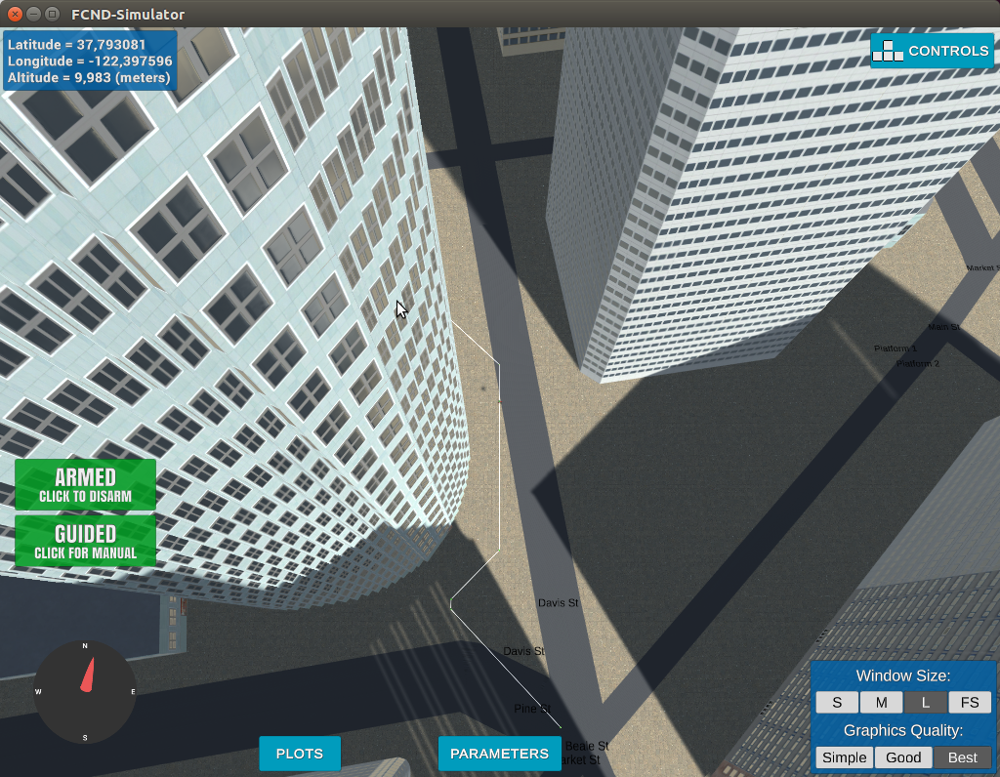

## Project: 3D Motion Planning


## [Rubric](https://review.udacity.com/#!/rubrics/1534/view) Points
### Here I will consider the rubric points individually and describe how I addressed each point in my implementation.  

---
### Writeup / README

#### 1. Provide a Writeup / README that includes all the rubric points and how you addressed each one.  You can submit your writeup as markdown or pdf.  

You're reading it! Below I describe how I addressed each rubric point and where in my code each point is handled.

### Explain the Starter Code

#### 1. Explain the functionality of what's provided in `motion_planning.py` and `planning_utils.py`


Like in the `backyardflyer` project the `motion_planning.py`  contains the main code that will plan run the commmands to guide the drone. The programming paradigm in which the program is written doesn't rely on time to schedule the path of the drone but on event programming. There are several distinct events like "Take Off", "Landing", "Arming", etc. The program takes care the sequence of these events so that the it is still responsive if ,while it's moving, there's an unexpected obstacle. Also, the program is responsible for calling the planning function so that it can find a path between a starting and a goal location. Finding a path is done using a modified version of the `a_star` algorithm that it is defined in `planning_utils.py`. I have also included diagonal movements beyond what was provided in the starter code as this was a requirement (method `valid_actions()`.

#### 1.1 Minimal requirement is to modify the code in `planning_utils()` to update the A* implementation to include diagonal motions on the grid that have a cost of `sqrt(2)`, but more creative solutions are welcome. Explain the code you used to accomplish this step.

I'm adding this new paragraph to address the comment of the reviewer:

>The A* has been updated, well done. Please add some explanation here.

First, A* is an algorithm that searches for a path(or paths) in a search space that has the minimal cost. This is done by continuously visiting nearby nodes but the ones that are closer to the goal given an estimate (heuristic). So, the A* star algorithm searches for a path to connect the initial position of the drone (start) to the goal position. The A* algorithm works on the 3D grid of a map and tries to find connections of a point on the grid to the next until the end goal. Without the modification I have added to the `valid_actions()` the path that the algorithm finds contains many zig-zag movements. It connects two points through a third by forming a triangle. However, if we set the cost of the diagonal movement to `sqrt(2)` the algorithm will always choose the less costly one connecting the two points that is a straight line with a cost of just `1`.  To apply this, I had to change the `Action` class to include the 4 diagonal actions:

* `NORTHWEST`
* `SOUTHWEST`
* `NORTHEAST`
* `SOUTHEAST`

with a cost of `sqrt(2)`. I also had to change the method `valid_actions()` so that the algorithm can remove the costly diagonal actions of `sqrt(2)` (see pythagorean theorem) and prefer the less costly straight of `1`. To do this I added the 4 lines below:

```
    if (x - 1 < 0 and y - 1 < 0) or grid[x - 1, y - 1] == 1:
        valid_actions.remove(Action.NORTHWEST)
    if (x + 1 > n and y - 1 < 0) or grid[x + 1, y - 1] == 1:
        valid_actions.remove(Action.SOUTHWEST)
    if (x - 1 < 0 and y + 1 > m) or grid[x - 1, y + 1] == 1:
        valid_actions.remove(Action.NORTHEAST)
    if (x + 1 > n and y + 1 > m) or grid[x + 1, y + 1] == 1:
        valid_actions.remove(Action.SOUTHEAST)
```

Since if we are on a cell on a grid there are available 8 actions (4 additional diagonal ones), I should be able to remove them if they're invalid. And they are invalid if they contain an obstacle or are beyond the available grid.

I used this table below to help me complete the code:


### Implementing Your Path Planning Algorithm

#### 1. Set your global home position

Starting the motion planner program first saves the central location as:
`
lat0,lon0
37.792480,-122.397450
`
In which it is then decoded in the in a local location. This is done in the following part:

```
        with open("colliders.csv") as myfile:
            head = [next(myfile) for x in range(2)]
        latlon = np.fromstring(head[1], dtype='Float64', sep=',')
        lat0 = latlon[0]
        lon0 = latlon[1]
        # TODO: set home position to (lat0, lon0, 0)
        self.set_home_position(lon0, lat0, 0)
```

I read the csv file twice because the file includes two formats (different columns on each one).


This is where the drone starts in the simulator:


#### 2. Set your current local position

I set the local position relative to the global home position using the following line:

```
current_local_pos = global_to_local(self.global_position,self.global_home)
```

I have previously set the home position in the line:

```
self.set_home_position(lon0, lat0, 0)
```
The lan0 and lat0 where retrieved from the `.csv` file.


#### 3. Set grid start position from local position
This is another step in adding flexibility to the start location. As long as it works you're good to go!

I set the grid start position in the line:

```
start = (int(current_local_pos[0]+north_offset),
int(current_local_pos[1]+east_offset))
```

I have taken into account the north and east offset on the map to find the place in the grid.

#### 4. Set grid goal position from geodetic coords

The goal is set using the two lines:

```
grid_goal = global_to_local((-122.401247,37.796738,0),self.global_home)
grid_goal = (int(grid_goal[0]+ north_offset),int(grid_goal[1]+ east_offset))
```

As you can see the input is in geodetic coordinates `(-122.401247,37.796738,0)` from which I retrieve the local coordinates using `global_to_local`. The user can also select their goal from running the script with arguments s:


```
python motion_planning.py --lat 37.796738 --lon
-122.401247
```

This was done by adding two arguments:
```
parser.add_argument('--lat', type=float, default=1000, help="latitude")
```
```
parser.add_argument('--lon', type=float, 
    default=1000, help="latitude")
```

#### 5. Modify A* to include diagonal motion (or replace A* altogether)

I have modified the selection of next moves in the A* to include diagonal motions:

The actions includes four new ones (diagonal) with cost `sqrt(2)`:

`NORTHWEST = (-1, -1, 1.41421)`

`SOUTHWEST = (1, -1, 1.41421)`

`NORTHEAST = (-1,1,1.41421) `

`SOUTHEAST = (1,1,1.41421)`

and in the `valid_actions` I have added:

```
    if (x - 1 < 0 and y - 1 < 0) or grid[x - 1, y - 1] == 1:
        valid_actions.remove(Action.NORTHWEST)
    if (x + 1 > n and y - 1 < 0) or grid[x + 1, y - 1] == 1:
        valid_actions.remove(Action.SOUTHWEST)
    if (x - 1 < 0 and y + 1 > m) or grid[x - 1, y + 1] == 1:
        valid_actions.remove(Action.NORTHEAST)
    if (x + 1 > n and y + 1 > m) or grid[x + 1, y + 1] == 1:
        valid_actions.remove(Action.SOUTHEAST)
```


#### 6. Cull waypoints

I used collinearity to prune the path. The prunning algorithm looks like this:

```
    def prune_path(self,path):
        def point(p):
            return np.array([p[0], p[1],
             1.]).reshape(1, -1)

        def collinearity_check(p1, p2,
         p3, epsilon=1e-6):
            m = np.concatenate((p1, p2, p3), 0)
            det = np.linalg.det(m)
            return abs(det) < epsilon
            
        pruned_path = []
        # TODO: prune the path!
        p1 = path[0]
        p2 = path[1]
        pruned_path.append(p1)
        for i in range(2,len(path)):
            p3 = path[i]
            if collinearity_check(point(p1),point(p2),
            point(p3)):
                p2 = p3
            else:
                pruned_path.append(p2)
                p1 = p2
                p2 = p3
        pruned_path.append(p3)


        return pruned_path
```

In collinearity I select continuous groups of points (3 in each step) to see if they belong in a line or approximately belong to a line. If they can be connected to a line I replace the two waypoints with a single one (longer) and continue the search to see if I can add more way points to the same line. With this change I managed to have a relatively smooth route:




### Execute the flight
#### 1. Does it work?
I tried the suggested location of ` (longitude = -122.402224, latitude = 37.797330)` and the drone guided itself into it. To go back just run from the goal position:

```
python motion_planning.py --lat 37.792480 --lon
 -122.397450
```

You can run any location you like by using the parameters `lat,lon` .

**Also**, note that the planning search takes more than 5 seconds which is the default time out limit. I changed the time out to `40` seconds:

```
    conn = MavlinkConnection('tcp:{0}:
    {1}'.format(args.host, args.port),timeout=40)
```

### Extra Challenges: Real World Planning 

I did not yet attempt any challenges but I plan to do later in the course.

For an extra challenge, consider implementing some of the techniques described in the "Real World Planning" lesson. You could try implementing a vehicle model to take dynamic constraints into account, or implement a replanning method to invoke if you get off course or encounter unexpected obstacles.
