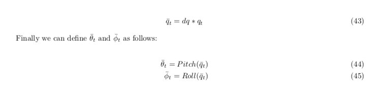
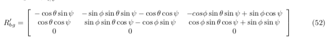
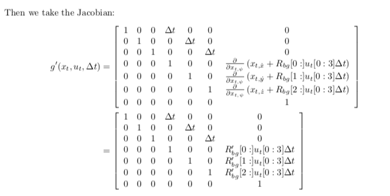
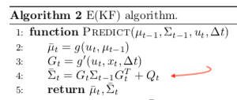
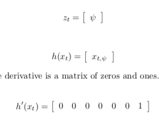
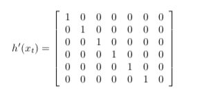
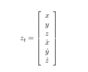

# Estimation Project - Writeup

### 1. Determine the standard deviation of the measurement noise of both GPS X data and Accelerometer X data. 

*The calculated standard deviation should correctly capture ~68% of the sensor measurements. Your writeup should describe the method used for determining the standard deviation given the simulated sensor measurements)*

I've determined the standar deviation of GPS and Accelerometer data as follows: 

I took the data from `Graph1.txt` and `Graph2.txt` and extracted the standar devitiation using the python code:

```
import csv
import sys
import math

with open("g2.txt") as f:
    reader = csv.reader(f)
    vals = []
    for row in reader:
        vals.append(row[1])
    vals = [float(i) for i in vals[1:]]
mean = float(sum(vals)/len(vals))

s=0
for i in vals:
    s = s + (i - mean)**2

print(math.sqrt(s/len(vals)))
```

The result:

```
MeasuredStdDev_GPSPosXY = 0.7221354406057051
MeasuredStdDev_AccelXY = 0.5131842554409878
```

### 2. Implement a better rate gyro attitude integration scheme in the `UpdateFromIMU()` function.

*The improved integration scheme should result in an attitude estimator of < 0.1 rad for each of the Euler angles for a duration of at least 3 seconds during the simulation. The integration scheme should use quaternions to improve performance over the current simple integration scheme.*

The purpose of this task is to find the estimated Pitch and Roll angles.



We get the quaternion from the ready project implementation:

```
Quaternion<float> qt = Quaternion<float>::FromEuler123_RPY(rollEst, pitchEst, ekfState(6));

```


I first tried to integrate according to the equations 43 but didn't get any good results:

```
qt = qt*dq;
```

but the built in integration method worked better:

```
qt.IntegrateBodyRate(gyro, dtIMU);
```

We then get the predicted values from the quaternion:

```
qt.Roll()
qt.Pitch()
```

### 3. Implement all of the elements of the prediction step for the estimator.

*The prediction step should include the state update element (PredictState() function), a correct calculation of the Rgb prime matrix, and a proper update of the state covariance. The acceleration should be accounted for as a command in the calculation of gPrime. The covariance update should follow the classic EKF update equation.*

I created the `RGB'` matrix from the document:



```
    float sinPhi = sin(roll);
    float cosPhi = cos(roll);
    float sinTheta = sin(pitch);
    float cosTheta = cos(pitch);
    float sinPsi = sin(yaw);
    float cosPsi = cos(yaw);
    
    RbgPrime(0, 0) = -cosTheta * sinPsi;
    RbgPrime(0, 1) = -sinPhi*sinTheta*sinPsi -cosTheta*cosPsi;
    RbgPrime(0, 1) = -cosPhi*sinTheta*sinPsi+sinPhi*cosPsi;
    
    RbgPrime(1, 0) = cosTheta * cosPsi;
    RbgPrime(1, 1) = sinPhi*sinTheta*cosPsi-cosPhi*sinPsi;
    RbgPrime(1, 2) = cosPhi*sinTheta*cosPsi+sinPhi*sinPsi;
```


G prime was calcuated with the following formula:



The python code from the lesson was helpful:

```
def g_prime(self,u):
    
    g_prime=np.identity(self.mu.shape[0])
    g_prime[0,3] = self.dt
    g_prime[1,4] = self.dt
    g_prime[2,5] = self.dt
    g_prime[3:6,5:6] =np.matmul(self.R_bg_prime, (u[:3]*self.dt) )
    
    return g_prime
```

and the ` C++` code:

```
  MatrixXf u(3,1);
  u(0,0) = accel.x*dt;
  u(1,0) = accel.y*dt;
  u(2,0) = accel.z*dt;
    
  MatrixXf m = RbgPrime * u;
    
  gPrime(0,3) = dt;
  gPrime(1,4) = dt;
  gPrime(2,5) = dt;

    
  gPrime(3,6) = m(0,0);
  gPrime(4,6) = m(1,0);
  gPrime(5,6) = m(2,0);
```

The updated (estimated) covariance was calculated from the equation:



```
ekfCov = gPrime*ekfCov*gPrime.transpose() + Q;
```

The `PredictState()` fuction makes a simple prediction by integrating the accelerations and velocities:

The `accel` input accelerations are in the body frames so we convert them to the inertial frame by using `attitude.Rotate_BtoI(accel)`.

Also, it is noted that we should account for gravity because it is not added to the values:

```
V3F att = attitude.Rotate_BtoI(accel) + V3F(0,0,-9.81f); /*The acceleration (accel) is without gravity*/
```

And simplistic integrations:

```
  predictedState(0) += ekfState(3)*dt;
  predictedState(1) += ekfState(4)*dt;
  predictedState(2) += ekfState(5)*dt;
  predictedState(3) += att.x*dt;
  predictedState(4) += att.y*dt;
  predictedState(5) += att.z*dt;
```

### 4. Implement the magnetometer update.

*The update should properly include the magnetometer data into the state. Note that the solution should make sure to correctly measure the angle error between the current state and the magnetometer value (error should be the short way around, not the long way).*

The magnetometer update asks for the `hPrime` and  `z_t` (named `zFromX` in the project):




```
zFromX(0)=ekfState(6);
```

```
hPrime(0,6)=1 //(Eveything else is zeros)
```


and normalize the difference between the measured and estimated yaw:

```
    float d = z(0) - ekfState(6);
    if (d > F_PI) z(0) -= 2.f*F_PI;
    if (d < -F_PI) z(0) += 2.f*F_PI;
```

### 5. Implement the GPS update.

*The estimator should correctly incorporate the GPS information to update the current state estimate.*

In the `UpdateFromGPS` method we're asked to calculate `hPrime`:



and `z_t`:



This was done with a simple for-loop:

```
    for (int i=0;i<6;i++){
        hPrime(i,i) = 1;
        zFromX(i) = ekfState(i);
    }
```

The estimated values were simple taken from `ekfState` as you can see above.

### 6. Meet the performance criteria of each step.

*For each step of the project, the final estimator should be able to successfully meet the performance criteria with the controller provided. The estimator's parameters should be properly adjusted to satisfy each of the performance criteria elements.*

The project passes all performance criteria.

### 7. De-tune your controller to successfully fly the final desired box trajectory with your estimator and realistic sensors.

*The controller developed in the previous project should be de-tuned to successfully meet the performance criteria of the final scenario (<1m error for entire box flight).*

I used my controller from control project and gain values and managed to pass the performance criteria without any significant changes.