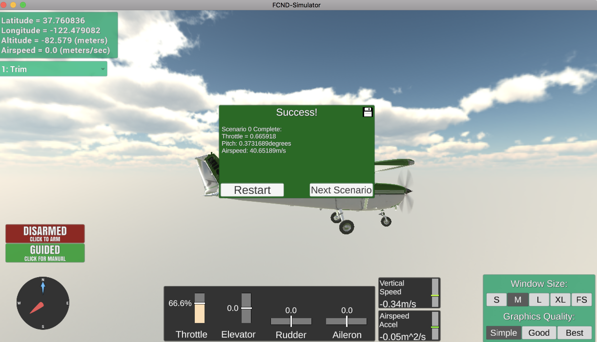

###Scenario #1 (Trim): The objective of this scenario is to find a fixed throttle trim for level flight with no elevator input.

###Scenario #2 (Altitude Hold): The objective of this scenario is to tune/implement a controller to maintain a constant altitude using the elevator.
