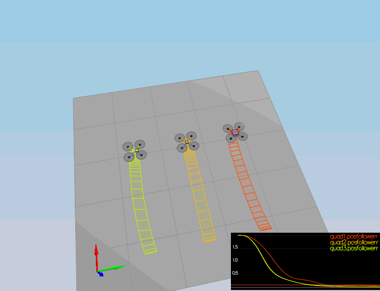
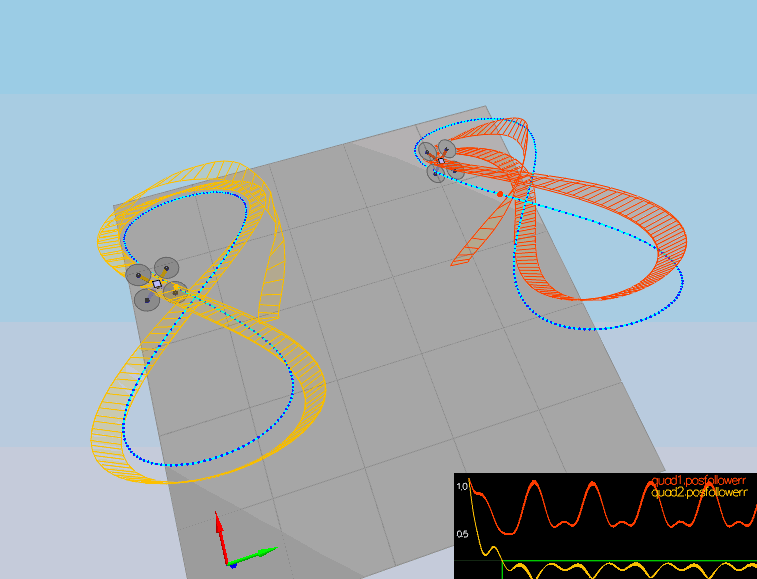

# Flying car Nanodegree
## Building a Controller: The Write up


### **Rubric 1**: Implemented body rate control in python and C++. The controller should be a proportional controller on body rates to commanded moments. The controller should take into account the moments of inertia of the drone when calculating the commanded moments.


I have implemented the proportional body rate controller in python according to the instructions in the lessons.

```
        [p_c,q_c,r_c] = body_rate_cmd
        [p_actual,q_actual,r_actual] = body_rate

        p_error = p_c - p_actual
        q_error = q_c - q_actual
        r_error = r_c - r_actual

        u_bar_p = self.k_p_p*p_error
        u_bar_q = self.k_p_q*q_error
        u_bar_r = self.k_p_r*r_error

        return np.array([np.clip(u_bar_p*MOI[0],-MAX_TORQUE,MAX_TORQUE), np.clip(u_bar_q*MOI[1],-MAX_TORQUE,MAX_TORQUE), np.clip(u_bar_r*MOI[2],-MAX_TORQUE,MAX_TORQUE)])
```
The body rate controller takes as input the p_c,q_c,r_c commands. It returns the desired 3 rotational moment commands and uses the required p,q,r gains. I also limited the returned moments according to the specifications. 

The CPP implementation is very similar as you can see below but the work done is exactly the same:

```
    float p_error = pqrCmd[0] - pqr[0];
    float q_error = pqrCmd[1] - pqr[1];
    float r_error = pqrCmd[2] - pqr[2];
    
    float u_bar_p = kpPQR[0]*p_error;
    float u_bar_q = kpPQR[1]*q_error;
    float u_bar_r = kpPQR[2]*r_error;
    
    float momentp = u_bar_p*Ixx;
    float momentq = u_bar_q*Iyy;
    float momentr = u_bar_r*Izz;
    
    momentCmd.x = momentp;
    momentCmd.y = momentq;
    momentCmd.z = momentr;
```

The controller takes into account the moments of inertia, Ix,Iy and Iz.

### **Rubric 2**: Implement roll pitch control in python and C++.The controller should use the acceleration and thrust commands, in addition to the vehicle attitude to output a body rate command. The controller should account for the non-linear transformation from local accelerations to body rates. Note that the drone's mass should be accounted for when calculating the target angles.

I implemented the roll pitch controller in python and C++. The python and C++ implementations follow:

```
        e = euler2RM(attitude[0],attitude[1],attitude[2])
        b_x_a = e[0][2]
        b_y_a = e[1][2]
        R33 = e[2][2]
        R21 = e[1][0]
        R22 = e[1][1]
        R12 = e[0][1]
        R11 = e[0][0]

        b_x_c_target = acceleration_cmd[0]*DRONE_MASS_KG/thrust_cmd
        b_y_c_target = acceleration_cmd[1]*DRONE_MASS_KG/thrust_cmd

        b_dot_x_c = self.k_p_roll*(b_x_c_target - b_x_a)
        b_dot_y_c = self.k_p_pitch*(b_y_c_target - b_y_a)
        # [[p_c],[q_c]] = (1/R33)*np.matmul(np.array([[R21,-R11],[R22,-R12]]),np.array([[b_dot_x_c],[b_dot_y_c]]))
        [[p_c],[q_c]] = (1.0/R33)*np.matmul(np.array([[R21,-R11],[R22,-R12]]),np.array([[b_dot_x_c],[b_dot_y_c]]))

        return np.array([p_c, q_c])
```

It takes a thrust command, x and y accelerations and the attitude of the drone (φ,ψ,θ) and outputs the p and q commands. `p_c`, `q_c`. As you can see from the implementation the mass of the drone is accounted when calculating the target angles.

```
    float b_x_a = R(0,2);
    float b_y_a = R(1,2);
    float R33 = R(2,2);
    float R21 = R(1,0);
    float R22 = R(1,1);
    float R12 = R(0,1);
    float R11 = R(0,0);
    
    float b_x_c_target = accelCmd[0]*mass/(collThrustCmd);
    float b_y_c_target = accelCmd[1]*mass/(collThrustCmd);
    
    float b_dot_x_c = kpBank*(b_x_c_target - b_x_a);
    float b_dot_y_c = kpBank*(b_y_c_target - b_y_a);
    
    float p_c = (1/R33)*(R21*b_dot_x_c - R11*b_dot_y_c);
    float q_c = (1/R33)*(R22*b_dot_x_c - R12*b_dot_y_c);

    pqrCmd.x = p_c;
    pqrCmd.y = q_c;
```

Also, the controller accounts for the non-linear transformation from local accelerations to body rates. This is represented by the first two expressions where the mass of the drone is accounted.:

```
    float b_x_c_target = accelCmd[0]*mass/(collThrustCmd);
    float b_y_c_target = accelCmd[1]*mass/(collThrustCmd);
```


### **Rubric 3**: Implement altitude control in python. The controller should use both the down position and the down velocity to command thrust. Ensure that the output value is indeed thrust (the drone's mass needs to be accounted for) and that the thrust includes the non-linear effects from non-zero roll/pitch angles.

The altitude control in python:

Python:

```
        e = euler2RM(attitude[0],attitude[1],attitude[2])
        b_z = e[2][2]

        u_bar_1 = self.z_k_p * (altitude_cmd - altitude) + self.z_k_d*(vertical_velocity_cmd - vertical_velocity) + acceleration_ff
        c = (u_bar_1 + GRAVITY)/b_z
        return np.clip(c*DRONE_MASS_KG,-MAX_THRUST,MAX_THRUST)
```

The altitude control ensures that the vehicle stayes close to the commanded set position and velocity by computing a thrust value. The output thrust is sent to the roll pitch controller. Because the commanded thrust is going to be shared across all dimensions. The portion that points in the x,y will determine acceleration in those directions.

As you can see the implementation uses both the down position (altitude) and the down velocity (`vertical_velocity`). The output value is a thrust since it's acceleration times mass (F=ma). The mass is obviously accounted for. Also, the non linear effects from non-zero rol/pitch angles is from the line `b_z = e[2][2]` in which the atitude of the drone is accounted for. 


### **Rubric 4**:Implement altitude controller in C++.The controller should use both the down position and the down velocity to command thrust. Ensure that the output value is indeed thrust (the drone's mass needs to be accounted for) and that the thrust includes the non-linear effects from non-zero roll/pitch angles. Additionally, the C++ altitude controller should contain an integrator to handle the weight non-idealities presented in scenario 4.

Similarly for the C++ version: The drone's mass is accounted for and also the non linear effects from non-zero pitch angels as before. Also, I have added the term `integratedAltitudeError` to handle the weight non-idealities.

```
    float b_z = R(2,2);
    
    velZCmd = -CONSTRAIN(-velZCmd,-maxDescentRate,maxAscentRate);
    float e = posZCmd - posZ;
    integratedAltitudeError += KiPosZ*e*dt;

    float u_bar_1 = kpPosZ*(posZCmd - posZ) + kpVelZ*(velZCmd - velZ) + accelZCmd + integratedAltitudeError;
    float accelZ = (u_bar_1 - 9.81f)/b_z;
    if (accelZ > 0){
        accelZ = 0;
    }
    
        thrust = -accelZ*mass;

```


### **Rubric 5**:Implement lateral position control in python and C++. The controller should use the local NE position and velocity to generate a commanded local acceleration.

This controller is a PD controller in the x and y trajectories. In generates an acceleration commandin the x-y directions which is sent to the roll pitch controller.

The controller uses the local NE position and velocity, `local_position_cmd` and `local_velocity_cmd` and it generates the commanded acceleration below. The negative sign shows that the position is in NE.

Python:

```
        x_dot_dot_command = self.x_k_p*(local_position_cmd[0] - local_position[0]) + self.x_k_d*(local_velocity_cmd[0] - local_velocity[0]) + acceleration_ff[0]
        y_dot_dot_command = self.y_k_p*(local_position_cmd[1] - local_position[1]) + self.y_k_d*(local_velocity_cmd[1] - local_velocity[1]) + acceleration_ff[1]
        return np.array([np.clip(-x_dot_dot_command,-10,10),np.clip(-y_dot_dot_command,-10,10)])
```

CPP:

```
    V3F desAccel;
    
    accelCmd[0] = CONSTRAIN(accelCmd[0], -maxAccelXY, maxAccelXY);
    accelCmd[1] = CONSTRAIN(accelCmd[1], -maxAccelXY, maxAccelXY);
    
    velCmd[0] = CONSTRAIN(velCmd[0], -maxSpeedXY,maxSpeedXY);
    velCmd[1] = CONSTRAIN(velCmd[1], -maxSpeedXY,maxSpeedXY);

    
    desAccel.x = kpPosXY*(posCmd[0] - pos[0]) + kpVelXY*(velCmd[0] - vel[0]) + accelCmd[0];
    desAccel.y = kpPosXY*(posCmd[1] - pos[1]) + kpVelXY*(velCmd[1] - vel[1]) + accelCmd[1];
    
    desAccel.x = -desAccel.x;//CONSTRAIN(desAccel.x, -maxAccelXY, maxAccelXY);
    desAccel.y = -desAccel.y;//CONSTRAIN(desAccel.y, -maxAccelXY, maxAccelXY);
    desAccel.x = CONSTRAIN(desAccel.x, -maxAccelXY, maxAccelXY);
    desAccel.y = CONSTRAIN(desAccel.y, -maxAccelXY, maxAccelXY);

    desAccel.z = 0;
```


### **Rubric 6**:Implement yaw control in python and C++. The controller can be a linear/proportional heading controller to yaw rate commands (non-linear transformation not required).

Yaw control is control through the reactive moment command and that command only effects yaw. I used a linear transformation:

Python:

```
        r_c = self.k_p_yaw*(yaw_cmd - yaw)

```

C++:

```
  yawCmd = CONSTRAIN(yawCmd, -maxTiltAngle, maxTiltAngle);
  yawRateCmd = kpYaw*(yawCmd - yaw);
```

### **Rubric 7**:Implement calculating the motor commands given commanded thrust and moments in C++.The thrust and moments should be converted to the appropriate 4 different desired thrust forces for the moments. Ensure that the dimensions of the drone are properly accounted for when calculating thrust from moments.

As you can see below the thrust and moment commands have been used to calculate the desired thrusts. To calculate the desired thrusts I used 4 equations:

```
  1)collThrustCmd = f1 + f2 + f3 + f4;
  2)momentCmd.x = l * (f1 + f4 - f2 - f3); // l = L*sqrt(2)/2) - perpendicular distance to axes
  3)momentCmd.y = l * (f1 + f2 - f3 - f4);
  4)momentCmd.z = kappa * f1 - kappa * f2 + kappa * f3 - kappa * f4;
```
where `torque = kappa * thrust`
 
The dimensions of the drone are accounted for in the 2 and 3 equations above:
 
```
float a = momentCmd.x/(L*(1.414213562373095/2));//(L*(1.414213562373095));
    float b = momentCmd.y/(L*(1.414213562373095/2));//(L*(1.414213562373095));
    float c = momentCmd.z/kappa;
    float d = collThrustCmd;

    cmd.desiredThrustsN[0] = ((a+b+c+d)/(4.f));
    cmd.desiredThrustsN[1] = ((-a+b-c+d)/(4.f));
    cmd.desiredThrustsN[3] = ((-a-b+c+d)/(4.f));
    cmd.desiredThrustsN[2] = ((a-b-c+d)/(4.f));

    
    cmd.desiredThrustsN[0] = CONSTRAIN(cmd.desiredThrustsN[0],minMotorThrust,maxMotorThrust);
    cmd.desiredThrustsN[1] = CONSTRAIN(cmd.desiredThrustsN[1],minMotorThrust,maxMotorThrust);
    cmd.desiredThrustsN[2] = CONSTRAIN(cmd.desiredThrustsN[2],minMotorThrust,maxMotorThrust);
    cmd.desiredThrustsN[3] = CONSTRAIN(cmd.desiredThrustsN[3],minMotorThrust,maxMotorThrust);


```


### **Rubric 8**:Your python controller is successfully able to fly the provided test trajectory, meeting the minimum flight performance metrics. For this, your drone must pass the provided evaluation script with the default parameters. These metrics being, your drone flies the test trajectory faster than 20 seconds, the maximum horizontal error is less than 2 meters, and the maximum vertical error is less than 1 meter.

The drone flies correctly the trajectory within the error margins as you can see below:

```
Maximum Horizontal Error:  1.2300934702378385
Maximum Vertical Error:  0.7203271772600734
Mission Time:  5.315563
Mission Success:  True
```

To provide a more accurate trajectory I used the following parameters in a similar way for the CPP project:

```
            z_k_p=18,     # kpPosZ
            z_k_d=6.8,     # kpVelZ
            x_k_p=2.6,    # kpPosXY
            x_k_d=1.7,   # kpVelXY
            y_k_p=2.6,    # kpPosXY
            y_k_d=1.7,   # kpVelXY
            k_p_roll=5.4,   # kpBank
            k_p_pitch=5.4,  # kpBank
            k_p_yaw=1,  # kpYaw
            k_p_p=12,      # kpPQR[0]
            k_p_q=12,      # kpPQR[1]
            k_p_r=4.5       # kpPQR[2]
```
and I used `time_mult=1`. The trajectory is also within margins with `time_mult=0.75`.

The errors in time:


There are two spikes as you can see in "horizontal error vs time" which I couldn't eliminate.


### **Rubric 9**: Your C++ controller is successfully able to fly the provided test trajectory and visually passes inspection of the scenarios leading up to the test trajectory.Ensure that in each scenario the drone looks stable and performs the required task. Specifically check that the student's controller is able to handle the non-linearities of scenario 4 (all three drones in the scenario should be able to perform the required task with the same control gains used).

The drone in the C++ Project flights correctly the trajectory and passes all tests:

```
PASS: ABS(Quad1.Pos.X) was less than 0.100000 for at least 1.250000 seconds
PASS: ABS(Quad2.Pos.X) was less than 0.100000 for at least 1.250000 seconds
PASS: ABS(Quad2.Yaw) was less than 0.100000 for at least 1.000000 seconds
Simulation #104 (../config/5_TrajectoryFollow.txt)
Simulation #105 (../config/5_TrajectoryFollow.txt)
PASS: ABS(Quad2.PosFollowErr) was less than 0.250000 for at least 3.000000 seconds
```




